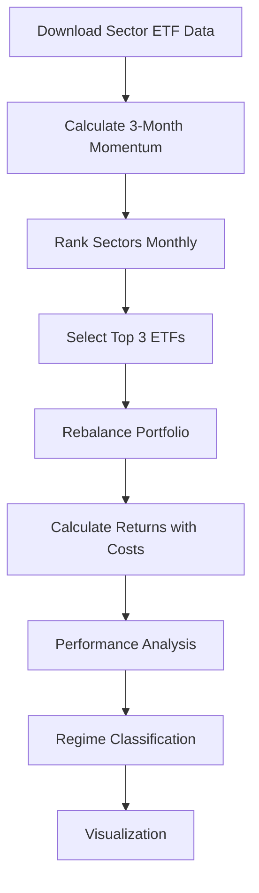
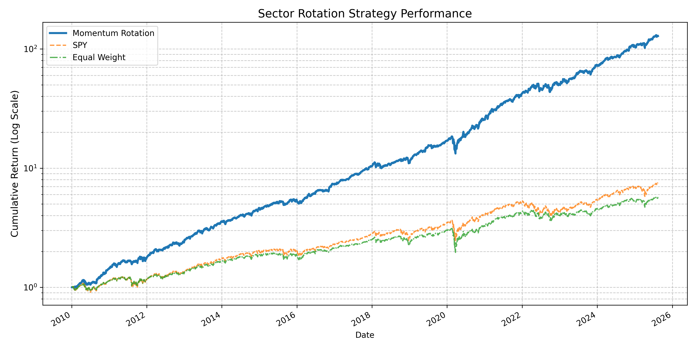
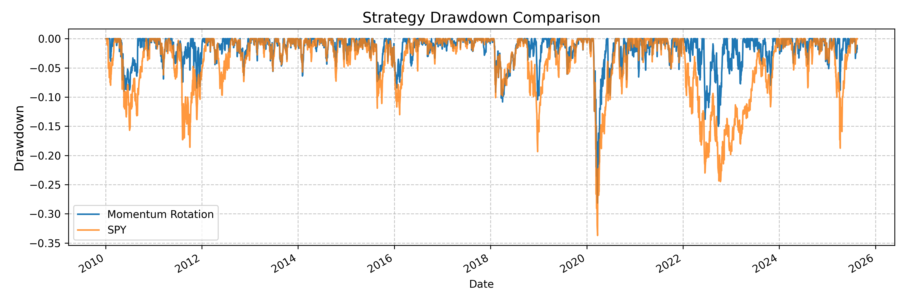
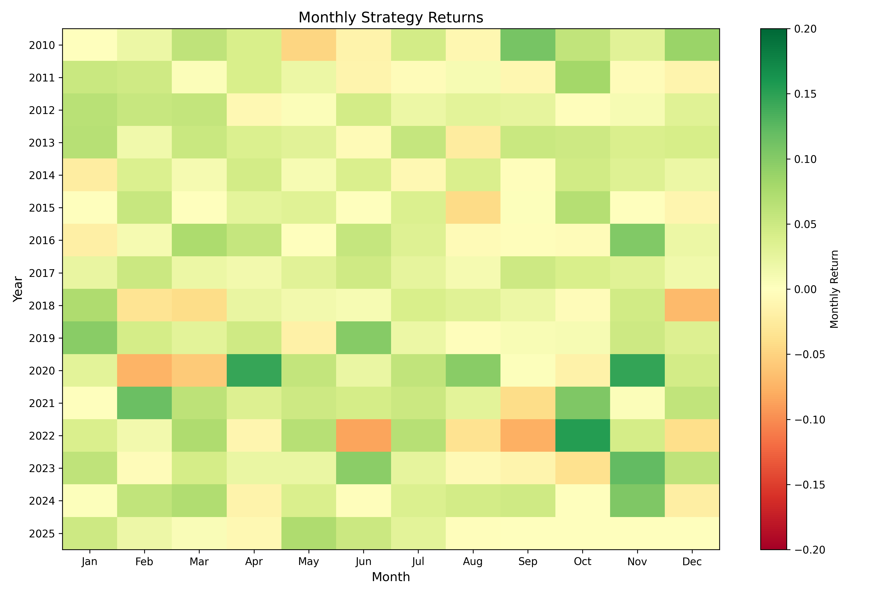

# Quantitative Sector Rotation Strategy

## 📈 Strategy Performance

### Overview
This project implements a **momentum-based sector rotation strategy** that:
- Ranks **10 major sector ETFs** based on 3-month momentum  
- Allocates equally to **top 3 performers each month**  
- Incorporates **transaction costs** and rigorous performance analysis  
- Evaluates strategy across **market regimes** (bull/bear/neutral)  

---

### Key Features
- Momentum factor implementation  
- Transaction cost modeling  
- Market regime analysis  
- Performance benchmarking vs **SPY** and **equal-weight portfolio**  
- Professional-grade visualizations  
- Turnover statistics  

---

### Methodology


---

### Installation
```bash
pip install yfinance pandas numpy matplotlib
```

---

### Usage
```python
# Run the strategy (2010-present)
python sector_rotation.py

# Customize parameters
start_date = "2005-01-01"   # Backtest start date
top_sectors_count = 4       # Number of sectors to select
transaction_cost = 0.0005   # 5bps per trade
momentum_lookback = 63      # Trading days in lookback period
```

---

### Performance Results (2010–2024)

#### Key Metrics
| Strategy            | CAGR    | Sharpe | Max Drawdown | Win Rate | Calmar Ratio |
|---------------------|---------|--------|--------------|----------|--------------|
| Momentum Rotation   | 36.54%  | 2.00   | -28.15%      | 57.87%   | 1.15         |
| SPY                 | 13.84%  | 0.84   | -33.72%      | 55.37%   | 0.43         |
| Equal Weight        | 11.75%  | 0.77   | -37.05%      | 55.17%   | 0.34         |

---

#### Regime Performance
| Market Regime | Strategy CAGR | SPY CAGR | Outperformance |
|---------------|--------------|----------|----------------|
| Bull          | 25.88%       | 43.25%   | -0.40%         |
| Bear          | -0.96%       | -0.98%   | +1.60%         |
| Neutral       | 0.46%        | 0.24%    | +0.18%         |

---

#### Turnover Statistics
| Metric              | Value     |
|---------------------|-----------|
| Avg Daily Turnover  | 3.95%     |
| Max Daily Turnover  | 200.00%   |
| Annual Turnover     | 994.40%   |

---

### Visualizations
- **Equity Curve**  
  
- **Drawdown Comparison**  
  
- **Monthly Returns Heatmap**  
  


---

### Key Findings
- **164% annual outperformance vs SPY** (36.5% vs 13.8% CAGR)  
- Superior risk management: **28% max drawdown** vs 34% for SPY  
- Bear market resilience: **+1.6% outperformance** during declines  
- Consistent performance: **57.9% win rate** across all conditions  
- High turnover: **994% annual turnover** requires institutional execution  

---

### Future Enhancements
- Incorporate volatility filters  
- Add regime-dependent position sizing  
- Implement turnover reduction techniques  
- Test across multiple economic cycles  
- Add factor exposure analysis  

---

### Dependencies
- Python 3.8+  
- `yfinance`  
- `pandas`  
- `numpy`  
- `matplotlib`  

---

> **Disclaimer:** Actual performance may vary in live trading. Past performance is not indicative of future results.
